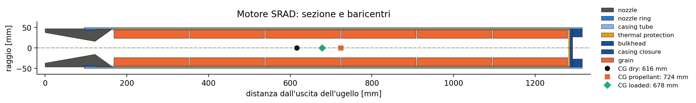

# `motor_mass_properties.py`: baricentri e inerzie del motore SRAD

Lo script ricava massa, baricentro e inerzie di un motore SRAD dal file di parametri scritto dal notebook di propulsione (`ATLAS_PARAMETERS_*.txt`) e disegna la sezione del motore. I valori servono a `motor.csv` del modello (`simulation_inputs/propulsion_data/SRAD/<versione>/`).



## 1. Uso

```bash
python Atlas/tools/motor_mass_properties.py "Atlas/simulation_inputs/propulsion_data/SRAD/v1.0/ATLAS_PARAMETERS_1.0 GRAPHITE.txt"
```

| Opzione | Significato |
|---|---|
| `--output <cartella>` | dove salvare i risultati (di default la cartella del txt) |
| `--rho-casing`, `--rho-phenolic`, `--rho-nozzle` | densità dei materiali [kg/m³] (di default 2700, 1500, 1950) |
| `--no-drawing` | non disegna la sezione |

Risultati:
- a terminale: massa, estensione e baricentro di ogni pezzo, poi massa, baricentro e inerzie dei tre gruppi (a secco, propellente, motore pieno);
- `mass_properties.csv`: gli stessi valori;
- `motor_section.png` e `motor_section.pdf`: il disegno.

In `motor.csv` vanno:

| `motor.csv` | Valore dello script |
|---|---|
| `motor_dry_mass` | massa del gruppo a secco |
| `motor_dry_mass_position` | baricentro del gruppo a secco |
| `motor_inertia_11`, `motor_inertia_33` | inerzie del gruppo a secco |
| `grains_center_of_mass_position` | baricentro del propellente |

## 2. Sistema di riferimento
- Asse $x$ lungo l'asse del motore, con origine all'uscita dell'ugello ($x = 0$) e positivo verso la camera di combustione. È il sistema `nozzle_to_combustion_chamber` di RocketPy, quindi le posizioni si copiano in `motor.csv` senza conversioni.
- $r$ è la distanza dall'asse.
- Il txt è in mm e kg; lo script converte tutte le lunghezze in metri (`mm(key)` = valore / 1000).
- $I_{11}$ è l'inerzia attorno a un asse perpendicolare all'asse del motore, $I_{33}$ quella attorno all'asse del motore. Entrambe sono calcolate rispetto al baricentro del gruppo di pezzi considerato, come richiede RocketPy per `dry_inertia`.

## 3. Geometria
<!-- io sostituirei questa sezione 3.1 interamente con il disegno che ti ho fatto fare, a cui devi cavare la colonna coi numeri dalla tabella, anzi caverei proprio tutti i numeri dal disegno, perchè tanto deve solo mostrare com'è fatto il motore per far capire all'utente come sono definiti i raggi (int/ext) e le coordinate di inizio e fine di ogni pezzo-->
### 3.1 Stazioni assiali
Il notebook dimensiona la lunghezza dei grain in modo che riempiano esattamente il case:

$$L_{grain} = \frac{L_{cc} - L_{bulkhead} - t_{tp} - L_{housing} - L_{ring} - (n+1)\,g}{n}$$

con $n$ numero di grain e $g$ distanza tra i grain. Lo script usa la stessa disposizione, dall'ugello verso la testa:

| Stazione | Formula | Valore v1.0 [m] |
|---|---|---|
| fine dell'ugello lato camera | $L_{tot} = L_{conv} + L_{div}$ | 0,1654 |
| inizio del case | $x_{case} = L_{tot} - (L_{ring} + L_{housing})$ | 0,0954 |
| inizio della colonna di grain | $x_{grain} = L_{tot}$ | 0,1654 |
| chiusura della protezione termica | $x_{tp} = x_{grain} + L_{tp}$ | 1,2824 |
| inizio del bulkhead | $x_{bh} = x_{tp} + t_{tp}$ | 1,2854 |
| fine del case | $x_{fine} = x_{case} + L_{cc}$ | 1,3154 |

dove $L_{tp} = n\,L_{grain} + (n+1)\,g$ è la lunghezza della colonna di grain, cioè del liner. Lo script controlla che $x_{bh} + L_{bulkhead} = x_{fine}$: se il txt non è coerente si ferma con un errore.

### 3.2 Pezzi
Ogni pezzo è un solido di rivoluzione tra $x_0$ e $x_1$, con raggio esterno $r_e(x)$ e interno $r_i(x)$:

| Pezzo | $x_0 \rightarrow x_1$ | $r_e$ | $r_i$ | Materiale |
|---|---|---|---|---|
| ugello | $0 \rightarrow L_{tot}$ | $D_{cc}/2$ | profilo dell'ugello (3.3) | grafite |
| nozzle ring | $x_{case} \rightarrow x_{case} + L_{ring}$ | $D_{cc}/2$ | $D_{cc}/2 - t_{ring}$ | alluminio |
| case | $x_{case} \rightarrow x_{fine}$ | $D_{cc,est}/2$ | $D_{cc}/2$ | alluminio |
| liner della protezione termica | $x_{grain} \rightarrow x_{tp}$ | $D_{cc}/2$ | $D_{cc}/2 - t_{tp}$ | fenolica |
| chiusura della protezione termica | $x_{tp} \rightarrow x_{bh}$ | $D_{cc}/2$ | 0 | fenolica |
| bulkhead | $x_{bh} \rightarrow x_{bh} + L_{bulkhead}$ | $D_{cc}/2$ | $D_{cc}/2 - t_{fillet}$ | alluminio |
| disco di chiusura del case | $x_{fine} - 2t_{case} \rightarrow x_{fine}$ | $D_{cc}/2$ | 0 | alluminio |
| grain $k$ ($k = 0 \dots n-1$) | $x_{grain} + g + k(L_{grain}+g) \rightarrow$ $+\,L_{grain}$ | $D_{est}/2$ | $D_{int}/2$ | propellente |

Sono gli stessi pezzi, con gli stessi volumi, che il notebook somma per `M_casing`, `M_tp`, `M_nozzle` e `M_nozzle_ring`.

### 3.3 Profilo interno dell'ugello
Il notebook calcola la massa dell'ugello come un cilindro di diametro $D_{cc}$, scavato da due tronchi di cono. Il raggio interno varia quindi linearmente:

$$r_i(x) = \begin{cases} \dfrac{D_{exit}}{2} + \dfrac{D_{throat} - D_{exit}}{2}\,\dfrac{x}{L_{div}} & 0 \le x < L_{div} \quad \text{(divergente)} \\[2ex] \dfrac{D_{throat}}{2} + \dfrac{D_{cc} - D_{throat}}{2}\,\dfrac{x - L_{div}}{L_{conv}} & L_{div} \le x \le L_{tot} \quad \text{(convergente)} \end{cases}$$

Il convergente arriva a $D_{cc}$ e non a $D_{conv}$, come nel volume del notebook.

### 3.4 Densità dei grain
La densità del propellente si ricava dalla massa del txt:

$$\rho_{grain} = \frac{M_{pr}}{n\,\pi\left(\frac{D_{est}^2}{4} - \frac{D_{int}^2}{4}\right) L_{grain}}$$

### 3.5 Ipotesi
Queste informazioni non sono nel txt:
- l'ugello sta negli ultimi $L_{ring} + L_{housing}$ (70 mm) del case e sporge per il resto della sua lunghezza (95 mm);
<!-- no guarda sono abbastanza sicuro che in realtà quel disco di chiusura sia appoggiato alla chiusura protezione termica del motore, lo dico perchè ho visto quel pezzo realizzato coi miei occhi, però leggi nella simulazione di propulsione per vedere se danno delle informazioni-->
- il disco di $2\,t_{case}$ che il notebook somma alla massa del case è in testa al motore;
- le densità dei materiali sono quelle del notebook (opzioni `--rho-*`).

Se il CAD di propulsione è diverso vanno corretti `build_parts` (stazioni e pezzi) o le densità.

## 4. Massa, baricentro e inerzie

### 4.1 Divisione in fette
Ogni pezzo è diviso in $N = 4000$ fette di spessore $\Delta x = (x_1 - x_0)/N$. Ogni fetta è un anello con centro $x_j$ (punto medio), raggi $r_{e,j} = r_e(x_j)$ e $r_{i,j} = r_i(x_j)$ e massa

$$\Delta m_j = \rho\,\pi\left(r_{e,j}^2 - r_{i,j}^2\right)\Delta x$$

Con raggi costanti la somma è esatta; per l'ugello, dove i raggi variano, approssima l'integrale con la regola del punto medio. 

### 4.2 Formule
Per un gruppo di pezzi (tutte le fette insieme):

$$m = \sum_j \Delta m_j \qquad x_{CG} = \frac{\sum_j \Delta m_j\, x_j}{m}$$

$$I_{33} = \sum_j \tfrac{1}{2}\,\Delta m_j\left(r_{e,j}^2 + r_{i,j}^2\right)$$

$$I_{11} = \sum_j \left[\tfrac{1}{4}\,\Delta m_j\left(r_{e,j}^2 + r_{i,j}^2\right) + \Delta m_j\,(x_j - x_{CG})^2\right]$$

- $I_{33}$ è la somma delle inerzie assiali degli anelli.
- In $I_{11}$, il primo termine è l'inerzia dell'anello attorno a un suo diametro. Il secondo è il trasporto (Steiner) dal centro della fetta al baricentro del gruppo. <!-- non ho capito questo termine trascurato --> Il termine $\Delta m\,\Delta x^2/12$ della fetta è trascurato perché $\Delta x$ è dell'ordine di 0,04 mm.

### 4.3 Gruppi
| Gruppo | Pezzi | Uso |
|---|---|---|
| a secco | ugello, ring, case, protezioni termiche, bulkhead, disco | `motor_dry_mass`, `motor_dry_mass_position`, `motor_inertia_11/33` |
| propellente | i grain | `grains_center_of_mass_position` |
| motore pieno | tutti | solo controllo |

## 5. Il codice blocco per blocco

**Costanti.** `RHO_CASING`, `RHO_PHENOLIC` e `RHO_NOZZLE` sono le densità del notebook; `N_SLICES` è il numero di fette per pezzo.

**Classe `Part`.** Descrive un pezzo:
- nome;
- gruppo (`"dry"` o `"propellant"`);
- densità;
- $x_0$, $x_1$;
- funzioni $r_e(x)$ e $r_i(x)$;
- colore nel disegno.

Il metodo `slices()` divide il pezzo in fette e restituisce centri, masse e raggi delle fette (4.1).

**`constant(value)`.** Restituisce una funzione che vale sempre `value`, per i raggi costanti.

**`read_parameters(path)`.** Legge il txt riga per riga (`"nome" = valore`) e restituisce un dizionario nome → valore.

**`build_parts(p, ...)`.**
1. Converte le lunghezze in metri.
2. Calcola le stazioni (3.1) e controlla che i pezzi riempiano il case.
3. Calcola la densità dei grain (3.4).
4. Definisce il profilo dell'ugello (3.3).
5. Crea la lista dei pezzi (3.2): prima quelli a secco, poi un `Part` per ogni grain.

**`mass_properties(parts)`.** Unisce le fette di tutti i pezzi della lista e applica le formule 4.2. Restituisce massa, $x_{CG}$, $I_{11}$, $I_{33}$. La stessa funzione serve per un pezzo solo, per un gruppo e per il motore intero.

**`draw(parts, results, path)`.** Disegna ogni pezzo come due poligoni, sopra e sotto l'asse, tra $r_i(x)$ e $r_e(x)$. Poi aggiunge i tre baricentri e salva png e pdf. Gli assi sono in scala 1:1.

**`main()`.**
1. Legge gli argomenti.
2. Costruisce i pezzi e li divide nei gruppi a secco e propellente.
3. Calcola le proprietà dei tre gruppi.
4. Stampa la tabella dei pezzi e quella dei gruppi.
5. Scrive `mass_properties.csv` e disegna la sezione.
<!-- queste verifiche le metterei in automatico dentro il codice con tipo dei warning se già non sono presenti, giusto per fare un doppio check che i numeri che calcoliamo noi siano uguali a quelli di propulsione. Per il confronto con rocketpy non saprei bene come fare, forse si riesce a fargli stampare questi valori che dici e poi li controlla un umano a occhio -->
## 6. Verifiche 
Sul txt di SRAD v1.0:
- **Masse:** la massa a secco è 6,4377 kg e quella del propellente 8,834 kg, come `M_motor_dry` e `M_pr` del notebook. Anche i singoli pezzi coincidono:
  - case + bulkhead + disco = `M_casing`;
  - liner + chiusura = `M_tp`.
- **Confronto con RocketPy:** con `motor.csv` compilato dai valori dello script, RocketPy calcola per il motore pieno un baricentro di 0,6785 m e un $I_{11}$ di 2,1926 kg·m². Lo script dà 0,6785 m e 2,1925 kg·m².
