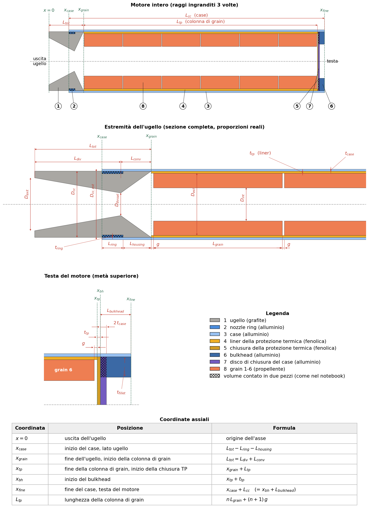

# `motor_mass_properties.py`: baricentri e inerzie del motore SRAD

Lo script ricava massa, baricentro e inerzie di un motore SRAD dal file di parametri scritto dal notebook di propulsione (`ATLAS_PARAMETERS_*.txt`) e disegna la sezione del motore. I valori servono a `motor.csv` del modello (`simulation_inputs/propulsion_data/SRAD/<versione>/`).


## 1. Uso

```bash
python Atlas/tools/motor_mass_properties.py "Atlas/simulation_inputs/propulsion_data/SRAD/v1.0/ATLAS_PARAMETERS_1.0 GRAPHITE.txt"
```

| Opzione | Significato |
|---|---|
| `--output <cartella>` | dove salvare i risultati (di default la cartella del txt) |
| `--rho-casing`, `--rho-phenolic`, `--rho-nozzle` | densità dei materiali [kg/m³] (di default 2700, 1500, 1950) |
| `--no-drawing` | non disegna la sezione |
| `--no-rocketpy` | salta il confronto con RocketPy (sezione 6) |

Risultati:
- a terminale: massa, estensione e baricentro di ogni pezzo, poi massa, baricentro e inerzie dei tre gruppi (a secco, propellente, motore pieno);
- `mass_properties.csv`: gli stessi valori;
- `motor_section.png` e `motor_section.pdf`: il disegno;
- a terminale, alla fine, le verifiche della sezione 6.

In `motor.csv` vanno:

| `motor.csv` | Valore dello script |
|---|---|
| `motor_dry_mass` | massa del gruppo a secco |
| `motor_dry_mass_position` | baricentro del gruppo a secco |
| `motor_inertia_11`, `motor_inertia_33` | inerzie del gruppo a secco |
| `grains_center_of_mass_position` | baricentro del propellente |

## 2. Sistema di riferimento
- Asse $x$ lungo l'asse del motore, con origine all'uscita dell'ugello ($x = 0$) e positivo verso la camera di combustione. È il sistema `nozzle_to_combustion_chamber` di RocketPy, quindi le posizioni si copiano in `motor.csv` senza conversioni.
- $r$ è la distanza dall'asse.
- Il txt è in mm e kg; lo script converte tutte le lunghezze in metri (`mm(key)` = valore / 1000).
- $I_{11}$ è l'inerzia attorno a un asse perpendicolare all'asse del motore, $I_{33}$ quella attorno all'asse del motore. Entrambe sono calcolate rispetto al baricentro del gruppo di pezzi considerato, come richiede RocketPy per `dry_inertia`.

## 3. Geometria

### 3.1 Disegno


Le coordinate $x$ sono le posizioni lungo l'asse che separano i pezzi; la tabella in fondo al disegno dice come si calcolano. Gli altri simboli sono parametri del txt:

| Simbolo | Nel txt | Simbolo | Nel txt |
|---|---|---|---|
| $L_{div}$, $L_{conv}$, $L_{tot}$ | `L_div`, `L_conv`, `L_total` | $D_{exit}$, $D_{throat}$ | `D_exit`, `D_throat` |
| $L_{ring}$, $t_{ring}$ | `L_nozzle_ring`, `th_nozzle_ring` | $D_{cc}$, $D_{cc,est}$ | `D_cc`, `D_cc_outer` |
| $L_{housing}$ | `nozzle_housing_length` | $t_{case}$ | `th_casing` |
| $L_{cc}$ | `L_cc` | $t_{tp}$ | `tp_thickness` |
| $L_{tp}$ | `length_tp` | $L_{bulkhead}$, $t_{fillet}$ | `L_bulkhead`, `th_bulkhead_fillet` |
| $L_{grain}$, $g$, $n$ | `L_single_grain`, `grains_distance`, `n_grains` | $D_{est}$, $D_{int}$ | `D_ext`, `D_int` |

Il notebook sceglie la lunghezza dei grain in modo che riempiano esattamente il case:

$$L_{grain} = \frac{L_{cc} - L_{bulkhead} - t_{tp} - L_{housing} - L_{ring} - (n+1)\,g}{n}$$

con $n$ numero di grain. Per questo deve valere $x_{bh} + L_{bulkhead} = x_{fine}$. Lo script lo controlla e, se il txt non è coerente, si ferma con un errore.

### 3.2 Pezzi
Ogni pezzo è un solido di rivoluzione tra $x_0$ e $x_1$, con raggio esterno $r_e(x)$ e interno $r_i(x)$:

| Pezzo | $x_0 \rightarrow x_1$ | $r_e$ | $r_i$ | Materiale |
|---|---|---|---|---|
| ugello | $0 \rightarrow L_{tot}$ | $D_{cc}/2$ | profilo dell'ugello (3.3) | grafite |
| nozzle ring | $x_{case} \rightarrow x_{case} + L_{ring}$ | $D_{cc}/2$ | $D_{cc}/2 - t_{ring}$ | alluminio |
| case | $x_{case} \rightarrow x_{fine}$ | $D_{cc,est}/2$ | $D_{cc}/2$ | alluminio |
| liner della protezione termica | $x_{grain} \rightarrow x_{tp}$ | $D_{cc}/2$ | $D_{cc}/2 - t_{tp}$ | fenolica |
| chiusura della protezione termica | $x_{tp} \rightarrow x_{bh}$ | $D_{cc}/2$ | 0 | fenolica |
| bulkhead | $x_{bh} \rightarrow x_{bh} + L_{bulkhead}$ | $D_{cc}/2$ | $D_{cc}/2 - t_{fillet}$ | alluminio |
| disco di chiusura del case | $x_{bh} \rightarrow x_{bh} + 2t_{case}$ | $D_{cc}/2$ | 0 | alluminio |
| grain $k$ ($k = 0 \dots n-1$) | $x_{grain} + g + k(L_{grain}+g) \rightarrow$ $+\,L_{grain}$ | $D_{est}/2$ | $D_{int}/2$ | propellente |

Sono gli stessi pezzi, con gli stessi volumi, che il notebook somma per `M_casing`, `M_tp`, `M_nozzle` e `M_nozzle_ring`.

### 3.3 Profilo interno dell'ugello
Il notebook calcola la massa dell'ugello come un cilindro di diametro $D_{cc}$, scavato da due tronchi di cono. Il raggio interno varia quindi linearmente:

$$r_i(x) = \begin{cases} \dfrac{D_{exit}}{2} + \dfrac{D_{throat} - D_{exit}}{2}\,\dfrac{x}{L_{div}} & 0 \le x < L_{div} \quad \text{(divergente)} \\[2ex] \dfrac{D_{throat}}{2} + \dfrac{D_{cc} - D_{throat}}{2}\,\dfrac{x - L_{div}}{L_{conv}} & L_{div} \le x \le L_{tot} \quad \text{(convergente)} \end{cases}$$

Il convergente arriva a $D_{cc}$ e non a $D_{conv}$, come nel volume del notebook.

### 3.4 Densità dei grain
La densità del propellente si ricava dalla massa del txt:

$$\rho_{grain} = \frac{M_{pr}}{n\,\pi\left(\frac{D_{est}^2}{4} - \frac{D_{int}^2}{4}\right) L_{grain}}$$

### 3.5 Ipotesi
Queste informazioni non sono nel txt:
- l'ugello sta negli ultimi $L_{ring} + L_{housing}$ (70 mm) del case e sporge per il resto della sua lunghezza (95 mm).
- il disco di spessore $2\,t_{case}$ che il notebook somma alla massa del case è la faccia chiusa del bulkhead, appoggiata alla chiusura della protezione termica.
- le densità dei materiali sono quelle del notebook (opzioni `--rho-*`).

Per avere le stesse masse del notebook, lo script ne usa gli stessi volumi. In due punti questi volumi si sovrappongono (tratteggio nel disegno):
- l'ugello con il nozzle ring;
- il disco di chiusura e l'anello della bulkhead.

Se il CAD di propulsione è diverso vanno corretti `build_parts` (coordinate e pezzi) o le densità.

## 4. Massa, baricentro e inerzie

### 4.1 Divisione in fette
Ogni pezzo è diviso in $N = 4000$ fette di spessore $\Delta x = (x_1 - x_0)/N$. Ogni fetta è un anello con centro $x_j$ (punto medio), raggi $r_{e,j} = r_e(x_j)$ e $r_{i,j} = r_i(x_j)$ e massa

$$\Delta m_j = \rho\,\pi\left(r_{e,j}^2 - r_{i,j}^2\right)\Delta x$$

Con raggi costanti la somma è esatta; per l'ugello, dove i raggi variano, approssima l'integrale con la regola del punto medio. 

### 4.2 Formule
Per un gruppo di pezzi (tutte le fette insieme):

$$m = \sum_j \Delta m_j \qquad x_{CG} = \frac{\sum_j \Delta m_j\, x_j}{m}$$

$$I_{33} = \sum_j \tfrac{1}{2}\,\Delta m_j\left(r_{e,j}^2 + r_{i,j}^2\right)$$

$$I_{11} = \sum_j \left[\tfrac{1}{4}\,\Delta m_j\left(r_{e,j}^2 + r_{i,j}^2\right) + \tfrac{1}{12}\,\Delta m_j\,\Delta x^2 + \Delta m_j\,(x_j - x_{CG})^2\right]$$

$I_{33}$ è la somma delle inerzie assiali degli anelli.

$I_{11}$ dipende da quanto la massa è lontana da un asse perpendicolare al motore che passa per il baricentro. Ogni fetta è un cilindro cavo corto e i suoi tre termini sono:
1. $\tfrac14\,\Delta m\,(r_e^2+r_i^2)$: la massa è distribuita in raggio, tra $r_i$ e $r_e$;
2. $\tfrac1{12}\,\Delta m\,\Delta x^2$: la massa è distribuita lungo lo spessore $\Delta x$ della fetta, non è tutta nel suo centro. È lo stesso $mL^2/12$ di un'asta lunga $L$;
3. $\Delta m\,(x_j - x_{CG})^2$: il trasporto (Steiner) dal centro della fetta al baricentro del gruppo.

### 4.3 Gruppi
| Gruppo | Pezzi | Uso |
|---|---|---|
| a secco | ugello, ring, case, protezioni termiche, bulkhead, disco | `motor_dry_mass`, `motor_dry_mass_position`, `motor_inertia_11/33` |
| propellente | i grain | `grains_center_of_mass_position` |
| motore pieno | tutti | solo controllo |

## 5. Il codice blocco per blocco

**Costanti.** `RHO_CASING`, `RHO_PHENOLIC` e `RHO_NOZZLE` sono le densità del notebook; `N_SLICES` è il numero di fette per pezzo; `MASS_TOLERANCE` è la differenza dalle masse del notebook oltre la quale lo script dà un warning (sezione 6).

**Classe `Part`.** Descrive un pezzo:
- nome;
- gruppo (`"dry"` o `"propellant"`);
- densità;
- $x_0$, $x_1$;
- funzioni $r_e(x)$ e $r_i(x)$;
- colore nel disegno.

Il metodo `slices()` divide il pezzo in fette e restituisce centri, masse, raggi e spessori delle fette (4.1).

**`constant(value)`.** Restituisce una funzione che vale sempre `value`, per i raggi costanti.

**`read_parameters(path)`.** Legge il txt riga per riga (`"nome" = valore`) e restituisce un dizionario nome → valore.

**`build_parts(p, ...)`.**
1. Converte le lunghezze in metri.
2. Calcola le coordinate dei pezzi (3.1) e controlla che i pezzi riempiano il case.
3. Calcola la densità dei grain (3.4).
4. Definisce il profilo dell'ugello (3.3).
5. Crea la lista dei pezzi (3.2): prima quelli a secco, poi un `Part` per ogni grain.

**`mass_properties(parts)`.** Unisce le fette di tutti i pezzi della lista e applica le formule 4.2. Restituisce massa, $x_{CG}$, $I_{11}$, $I_{33}$. La stessa funzione serve per un pezzo solo, per un gruppo e per il motore intero.

**`check_notebook(parts, p)`.** Confronta le masse dei pezzi con quelle del txt (sezione 6).

**`check_rocketpy(parts, results, p)`.** Costruisce il motore in RocketPy con i valori da mettere in `motor.csv` e stampa le sue proprietà accanto a quelle dello script (sezione 6). Se rocketpy non è installato salta il confronto.

**`draw(parts, results, path)`.** Disegna ogni pezzo come due poligoni, sopra e sotto l'asse, tra $r_i(x)$ e $r_e(x)$. Poi aggiunge i tre baricentri e salva png e pdf. Gli assi sono in scala 1:1.

**`main()`.**
1. Legge gli argomenti.
2. Costruisce i pezzi e li divide nei gruppi a secco e propellente.
3. Calcola le proprietà dei tre gruppi.
4. Stampa la tabella dei pezzi e quella dei gruppi.
5. Scrive `mass_properties.csv` e disegna la sezione.
6. Esegue le verifiche.
## 6. Verifiche
Lo script controlla da solo i risultati alla fine di ogni esecuzione.

**Masse del notebook.** `check_notebook` confronta:

| Nel txt | Somma dello script |
|---|---|
| `M_casing` | case + bulkhead + disco |
| `M_tp` | liner + chiusura della protezione termica |
| `M_nozzle` | ugello |
| `M_nozzle_ring` | nozzle ring |
| `M_motor_dry` | gruppo a secco |
| `M_pr` | grain |

Se una differenza supera lo 0,1% (`MASS_TOLERANCE`) stampa `<!> WARNING`: vanno controllate le densità (`--rho-*`) o i pezzi in `build_parts`.

**RocketPy.** `check_rocketpy` costruisce un `SolidMotor` con i valori che vanno in `motor.csv` e stampa massa, baricentro, $I_{11}$ e $I_{33}$ del motore pieno a $t = 0$, sia di RocketPy sia dello script. Va controllato a occhio che coincidano. Se non coincidono, RocketPy interpreta i valori in modo diverso dallo script, per esempio un riferimento sbagliato in `motor.csv`. La spinta usata è fittizia, ma non conta: a $t = 0$ i grain sono interi.

Sul txt v1.0 RocketPy e lo script danno gli stessi valori: 15,2717 kg, 0,6783 m, 2,1891 kg·m² e 0,02396 kg·m².
